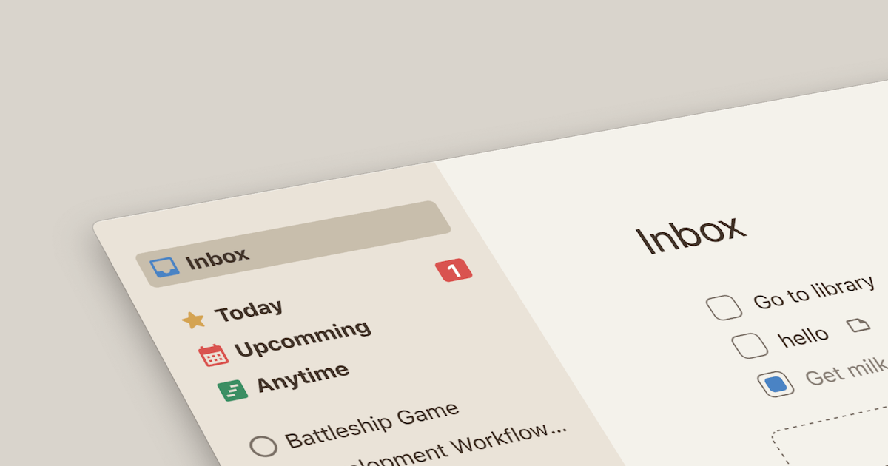

# The Odin Project - Todo

This is a solution to the [Todo challenge from the Odin Project](https://www.theodinproject.com/lessons/node-path-javascript-todo-list).

## Links

- Solution on: [GitHub](https://github.com/sydalwedaie/odin-project-todo)
- Live Site on: [Netlify](https://odin-project-todo-0usyw.netlify.app/)

## The Challenge

I wanted to take this as an opportunity to hone my architectural decision-making skills using vanilla JS, before moving on to libraries and frameworks that would abstract away a lot of these concepts.

## Code Organization

This is my second attempt at building using the MVC architecture.

`model.js` contains the business logic. It exposes a set of methods, accessible through the `collection`. For example, `collection.addTodo(details)`, `collection.deleteTodo(id)`, and so on. In the first iteration of this project, I had a million little classes that get called from other classes to build the model from the smallest building blocks. I had a `collection` class that built the whole database using the `project` class that built each project using a `todoList` class that used a `todo` class! Even then, I had a `Model` class that exposed all of the functions of the application by calling individual methods from those subclasses. It worked, but I reached a point where I could not follow the logic to even add a single feature. That is why in this final version, I only have a single `collection` class that holds the entire logic.

The view is split into several files, each starting with `view_`. They're responsible for defining the template and binding event listeners. Depending on the view type, these classes receive some part of the database and populate the template accordingly. Each view class has a _render_ function that, when called, renders the template to a root element that would be passed on when instantiating the view. The event listeners live in the same class, too, which makes them easily accessible later on through the controller. That way, I could do `sidebar.render()` and `sidebar.bindShowIndex()`, and I would instantly know where both methods were defined.

`controller.js` is the glue that instantiates a model and injects it into the view. In a strict MVC setup, the controller should not know anything about the HTML, or so I have read. Again, in a previous version, I had a `View()` class that would call each of the other view classes and expose their methods to the controller through a single view instance. I found that to be overkill for this project, so I included handles to a few key parts of the DOM in the controller; things like the sidebar and the main content area. That way, I would have a starting point to begin the rendering process directly from the controller.

## What I Learned

I had the biggest struggle wrapping my head around the concept of `bind` methods. These are functions that attach the event listener when called, expecting a click handler function, with an argument passed in from the view class. When I first learned about event listeners, I would get a hold of a DOM element, like a button, and do `addEventListener` directly on it, passing an inline function to do what I wanted that button to do. But that meant my event listener, which effectively lives in the controller part of the code, would need to know a lot about the view. The `bind` methods split this logic into two. The first part is a function that defines the listener. It lives in the view and has access to the DOM. This function does not return anything. It only _attaches_ the listener, and _calls_ a _click handler_ function that would be passed to the `bind` method in the controller. The `bind` method does NOT contain the logic of what happens when the event triggers. Instead, it passes a value to the controller and lets the controller determine what to do with it. What a mouthful!

Let's walk through this with an example:
The controller instantiates a model by `new Collection`. The controller now has access to `collection.projects()`, which returns an array of the projects. Nothing less, nothing more. The controller also instantiates a sidebar view by `new Sidebar()`, passing in the projects from the collection (to render the list of projects in the sidebar).

Sidebar has a `bindShowProject` method that _recieves_ a click handler, and _calls_ it, passing in the project's name that was clicked. At this point, the view does not care what `handleClick` is. It just knows that it should call it with the project's name when the event triggers.

```js
// view_sidebar.js
bindShowProject(handleClick) {
    this.root.addEventListener("click", (e) => {
        const btn = e.target.closest("button");
        if (btn && btn.dataset.projectName) {
            handleClick(btn.dataset.projectName);
        }
    });
}
```

Later, we call this method in the controller, passing an inline function. This inline function is the `handleClick` from the bind method. And the `btn.data.projectName` argument we passed there would correspond to the `projectName` parameter of this inline function in the controller. This function, in turn, would be in charge of the logic of showing the project (`renderContentView`).

```js
// controller.js
view.bindShowProject((projectName) => {
    this.renderContentView(
        this.#contentEl,
        "project",
        projectName,
        this.#collection.getTodosByProject(projectName)
    );
});
```

## Attribution

Designed based on [Things](https://culturedcode.com/things/) app.
